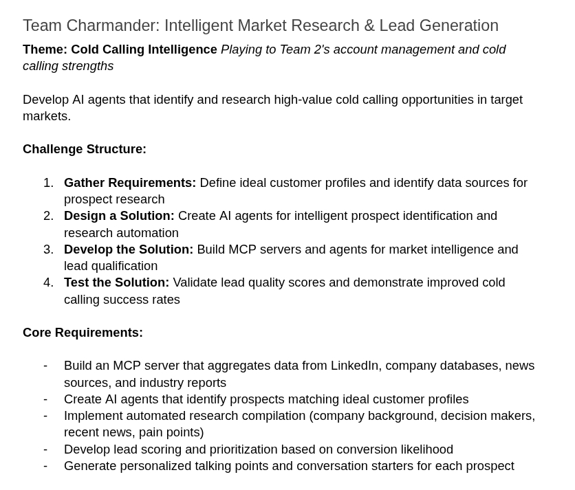

# AI Olympics Charmander: MCP Prospect Research Server

---

**Team Charmander - Infostatus AI Olympics 2025**  
**Status**: ✅ **PROJECT COMPLETE** - Production Ready  
**Achievement**: Complete AI-powered prospect research MCP server with LLM intelligence  

## 🎯 Challenge Achievement



**✅ Complete Solution** to the **Infostatus AI Olympics 2025 Challenge** - Week 1

## 🚀 MCP Server Capabilities

Our **Model Context Protocol (MCP) Server** provides 4 production-ready prospect research tools with integrated AI intelligence:

### ✅ **research_prospect** - AI-Enhanced Company Research
- **Intelligence**: LLM-powered business analysis with AWS Bedrock Claude integration
- **Input**: Company domain or name (e.g., "example.com" or "Acme Corp")
- **Output**: Comprehensive AI-analyzed research report with business insights
- **Data Sources**: Company website, LinkedIn, Apollo.io, job boards, news, government registries
- **Features**: Multi-source data collection, intelligent analysis, graceful fallback

### ✅ **create_profile** - AI-Powered Profile Generation  
- **Intelligence**: AI-generated conversation strategies and personalized talking points
- **Input**: Prospect ID from research_prospect
- **Output**: Strategic Mini Profile with AI conversation strategies
- **Features**: Business cycle awareness, decision maker analysis, objection handling

### ✅ **get_prospect_data** - Enhanced Context Retrieval
- **Input**: Any prospect ID (UUID or timestamp-based)
- **Output**: Complete prospect context with AI-enhanced content
- **Features**: Structured data retrieval, metadata enrichment

### ✅ **search_prospects** - Intelligent Content Search
- **Input**: Search query (company name, industry, keywords)
- **Output**: Matching prospects with relevance scoring and context snippets
- **Features**: Database and file content search, intelligent ranking

## 🎯 Project Achievement

This project implements a complete AI-powered lead generation system using **Spec-Driven Development (SDD)** with **3 successful deliverables**:

1. ✅ **ICP & Sales Process** - Complete business requirements and data source specifications
2. ✅ **MCP Server** - Production-ready Model Context Protocol server with 4 tools
3. ✅ **LLM Intelligence Middleware** - AWS Bedrock Claude integration for intelligent analysis

**Architecture**: 6-library modular design with comprehensive testing and error handling
**Performance**: Sub-30 second research cycles with multi-source data integration
**Intelligence**: AI-powered business analysis replacing manual data processing

## 🚀 Quick Start Guide

### **Production Setup**

```bash
# 1. Clone repository
git clone https://github.com/your-org/ai-olympics-charmander.git
cd ai-olympics-charmander

# 2. Install Python 3.11+ and UV package manager
curl -LsSf https://astral.sh/uv/install.sh | sh

# 3. Install dependencies
uv sync

# 4. Create environment file with your API keys
cp .env.example .env
# Edit .env with your API keys (see Configuration section)

# 5. Initialize system
uv run python -c "
from src.database.operations import initialize_database
from src.file_manager.storage import ensure_directories
initialize_database()
ensure_directories()
print('✅ Setup complete!')
"

# 6. Validate configuration
uv run python -m src.mcp_server.cli validate-env

# 7. Start MCP server
uv run python -m src.mcp_server.server
```

### **Demo Mode (No API Keys Required)**

```bash
# Quick test with mock data
git clone [repo] && cd ai-olympics-charmander
uv sync
uv run python -c "
from src.database.operations import initialize_database
from src.file_manager.storage import ensure_directories
initialize_database()
ensure_directories()
"
uv run python -m src.mcp_server.server
```

## ⚙️ Configuration

Create `.env` file in project root:

```env
# Required for full functionality
FIRECRAWL_API_KEY=your_firecrawl_api_key_here

# Required for AI intelligence features
AWS_ACCESS_KEY_ID=your_aws_access_key_here
AWS_SECRET_ACCESS_KEY=your_aws_secret_key_here
AWS_DEFAULT_REGION=ap-southeast-2

# Optional for enhanced data collection
APOLLO_API_KEY=your_apollo_api_key_here
SERPER_API_KEY=your_serper_api_key_here
LINKEDIN_EMAIL=your_linkedin_email_here
LINKEDIN_PASSWORD=your_linkedin_password_here

# Database (auto-created)
DATABASE_URL=sqlite:///data/database/prospects.db
```

**API Key Sources**:
- **Firecrawl API**: [firecrawl.dev](https://firecrawl.dev) for web scraping
- **AWS Bedrock**: AWS account with Bedrock access in ap-southeast-2 region
- **Apollo API**: [apollo.io](https://apollo.io) for enhanced contact data
- **Serper API**: [serper.dev](https://serper.dev) for enhanced search

**Note**: The server works in demo mode without any API keys for testing.

## 🔧 MCP Client Integration

### **For Coding Assistants**

```json
{
  "mcpServers": {
    "prospect-research": {
      "command": "uv",
      "args": ["run", "python", "-m", "src.mcp_server.server"],
      "cwd": "/path/to/ai-olympics-charmander"
    }
  }
}
```

### **For Other MCP Clients**

- **Transport**: stdio (JSON-RPC 2.0)
- **Capabilities**: tools, resources
- **Startup Command**: `uv run python -m src.mcp_server.server`
- **Working Directory**: Project root

## 🏗️ Architecture

### **System Overview**
```
src/
├── database/          # SQLite operations & models
├── file_manager/      # Markdown templates & file I/O  
├── prospect_research/ # Multi-source research engine
├── mcp_server/        # MCP protocol implementation
├── data_sources/      # Enhanced data collection (Apollo, Serper, etc.)
└── llm_enhancer/      # AI intelligence middleware
```

### **Data Flow**
1. **Research**: `research_prospect` → AI-enhanced analysis → `{id}_research.md`
2. **Profile**: `create_profile` → AI conversation strategy → `{id}_profile.md` 
3. **Retrieve**: `get_prospect_data` → Combined enhanced data
4. **Search**: `search_prospects` → Intelligent search with relevance scoring

### **Tech Stack**
- **Python 3.11+** with UV package manager
- **SQLite Database** with SQLAlchemy ORM  
- **MCP Protocol** (JSON-RPC 2.0 over stdio)
- **AWS Bedrock** with Claude Sonnet for AI analysis
- **Multi-source APIs** (Firecrawl, Apollo, Serper, LinkedIn)
- **Markdown-First** storage for human readability

## 🧪 Testing & Validation

```bash
# Run all tests
uv run pytest tests/ --tb=short

# Test specific components
uv run pytest tests/unit/ -v          # Unit tests
uv run pytest tests/integration/ -v   # Integration tests  
uv run pytest tests/contract/ -v      # Contract tests

# Validate environment and configuration
uv run python -m src.mcp_server.cli validate-env --verbose
uv run python -m src.mcp_server.cli test-config --component all

# Test MCP tools manually
uv run python -c "
from src.mcp_server.tools import research_prospect
result = research_prospect('example.com')
print(f'✅ Research generated: {result}')
"
```

## 📊 Project Summary

### ✅ **What Works**
- **Complete MCP Implementation**: All 4 tools operational with protocol compliance
- **AI Intelligence**: AWS Bedrock Claude integration for business analysis
- **Multi-source Data**: Apollo.io, Serper, Playwright, LinkedIn, Job Boards, News, Government
- **Error Handling**: Comprehensive validation and graceful fallback mechanisms
- **Demo Mode**: Full functionality without API keys for testing
- **Performance**: Sub-30 second research cycles with structured output
- **Search Capabilities**: Content search across all prospect data with relevance scoring

### 🎯 **Key Achievements**
- **Complete Spec Implementation**: All requirements from `specs/001-mcp-server-prospect/`
- **AI Enhancement**: LLM-powered business intelligence replacing manual processing
- **Production Ready**: Comprehensive testing, error handling, and configuration validation
- **Extensible Architecture**: 6-library modular design supporting future enhancements

## 📁 Repository Structure

```
ai-olympics-charmander/
├── src/                           # Production MCP server implementation
│   ├── database/                  # SQLite operations & models  
│   ├── file_manager/              # Markdown templates & storage
│   ├── prospect_research/         # AI-enhanced research engine
│   ├── mcp_server/                # MCP protocol server & tools
│   ├── data_sources/              # Multi-source data collection
│   └── llm_enhancer/              # AI intelligence middleware
├── specs/                         # Complete specifications & documentation
├── tests/                         # Comprehensive test suite
├── data/                          # Generated research files & database
├── PROJECT_OVERVIEW.md            # Detailed implementation progress
└── .env                           # Configuration file
```
